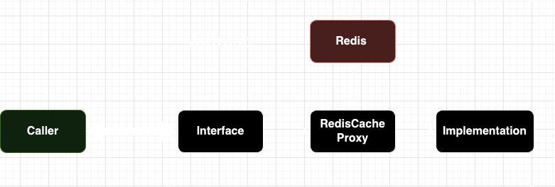
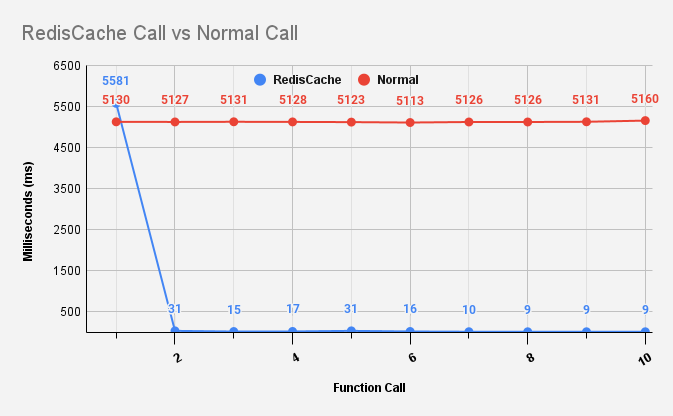

[](https://github.com/gregyjames/gj.autofac.caching.redis/actions/workflows/dotnetci.yml)
[](https://www.nuget.org/packages/gj.autofac.caching.redis)

[](https://www.codefactor.io/repository/github/gregyjames/gj.autofac.caching.redis)
[](https://app.codacy.com/gh/gregyjames/gj.autofac.caching.redis/dashboard?utm_source=gh&utm_medium=referral&utm_content=&utm_campaign=Badge_grade)

# autofac.caching.redis
Automatic function level caching using redis in C#.

## How it works

1. Upon initial request, the Proxy sends the request to the implementation then stores the value in Redis.
2. While the key hasn't expired, the Proxy will retrieve function values from Redis instead of recalculating function values.

## Usage
A full example can be found in the 	[gj.autofac.caching.redis.tester](https://github.com/gregyjames/gj.autofac.caching.redis/tree/main/gj.autofac.caching.redis.tester "gj.autofac.caching.redis.tester") directory.
```csharp
using System.Diagnostics;
using Autofac;
using Autofac.Extensions.DependencyInjection;
using Autofac.Extras.DynamicProxy;
using Microsoft.Extensions.Configuration;
using Microsoft.Extensions.DependencyInjection;
using Microsoft.Extensions.Logging;
using Serilog;
using Serilog.Events;

namespace gj.autofac.caching.redis.tester;

static class Program
{
    static void TimeAndRun(Action action, Microsoft.Extensions.Logging.ILogger logger)
    {
        var start = Stopwatch.StartNew();
        action.Invoke();
        start.Stop();
        logger.LogInformation("Time taken: {0}ms", start.Elapsed.TotalMilliseconds);
    }
    static Task Main()
    {
        var configuration = new ConfigurationBuilder()
            .SetBasePath(AppContext.BaseDirectory) // Base directory for appsettings.json
            .AddJsonFile("appsettings.json", optional: false, reloadOnChange: true)
            .Build();

        Log.Logger = new LoggerConfiguration()
            .MinimumLevel.Verbose()
            .WriteTo.Console(restrictedToMinimumLevel: LogEventLevel.Verbose)
            .CreateLogger();
       
        var services = new ServiceCollection();
        services.AddLogging(loggingBuilder =>
        {
            loggingBuilder.ClearProviders();
            loggingBuilder.AddSerilog(dispose: false);
        });
        
        var builder = new ContainerBuilder();
       
        //Either make sure IConfiguration or RedisConfig is registered.
        services.AddSingleton<IConfiguration>(configuration);
        
        builder.Populate(services);

	//Register an object Serializer
        builder.RegisterType<MessagePackObjectSerializer>().As<IObjectSerializer>();

        //Register the Redis Connection as single instance
        builder.RegisterType<RedisConnectionManager>().SingleInstance();
        
        builder.RegisterType<RedisCacheInterceptor>();
        
        builder.RegisterType<ExampleService>()
            .As<IExampleService>()
            .EnableInterfaceInterceptors()
            .InterceptedBy(typeof(RedisCacheInterceptor));

        var container = builder.Build();
        var service = container.Resolve<IExampleService>();
        var logger = container.Resolve<ILogger<ExampleService>>();
        
        var id = 3;

        for (var i = 0; i < 5; i++)
        {
            TimeAndRun(async () => await service.AsyncFunctionTest(id), logger);
        }

        return Task.CompletedTask;
    }
}
```
## Performance
Testing was done using the `TaskObjectReturnTest()` test with and without caching.


## License
MIT License

Copyright (c) 2024 Greg James

Permission is hereby granted, free of charge, to any person obtaining a copy
of this software and associated documentation files (the "Software"), to deal
in the Software without restriction, including without limitation the rights
to use, copy, modify, merge, publish, distribute, sublicense, and/or sell
copies of the Software, and to permit persons to whom the Software is
furnished to do so, subject to the following conditions:

The above copyright notice and this permission notice shall be included in all
copies or substantial portions of the Software.

THE SOFTWARE IS PROVIDED "AS IS", WITHOUT WARRANTY OF ANY KIND, EXPRESS OR
IMPLIED, INCLUDING BUT NOT LIMITED TO THE WARRANTIES OF MERCHANTABILITY,
FITNESS FOR A PARTICULAR PURPOSE AND NONINFRINGEMENT. IN NO EVENT SHALL THE
AUTHORS OR COPYRIGHT HOLDERS BE LIABLE FOR ANY CLAIM, DAMAGES OR OTHER
LIABILITY, WHETHER IN AN ACTION OF CONTRACT, TORT OR OTHERWISE, ARISING FROM,
OUT OF OR IN CONNECTION WITH THE SOFTWARE OR THE USE OR OTHER DEALINGS IN THE
SOFTWARE.
